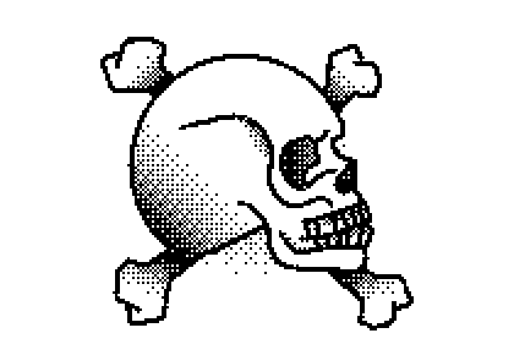
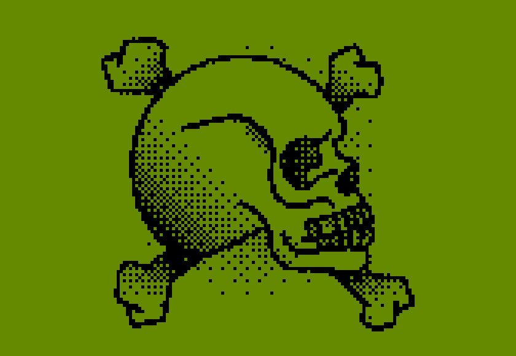

# Dither Guy 
Dither Guy is inspired by the Dither Boy software, used to create graphic dithering effects, similar to old screens.


Is a simple Python script that converts images to dithered images.  It uses the Floyd-Steinberg dithering algorithm to convert images to dithered images. The script is written in Python and uses the Pillow library to work with images.

## Input x Output
<div style="display: inline-block; margin-right: 10px;">
  
</div>
<div style="display: inline-block;">
  
</div>
<div style="display: inline-block;">
  
</div>
<br>
<div style="display: inline-block; margin-right: 10px;">
  
</div>
<div style="display: inline-block;">
  
</div>

## How to use
To use the script, you need to have Python installed on your computer. You also need to install the Pillowa and numpy libraries. You can install the Pillow and numpy libraries using the following command:

```bash
pip install Pillow
```

```bash
pip install numpy
```


After installing the Pillow library, you can run the script using the following command:

```bash
python dither_guy.py input_image output_image
```

