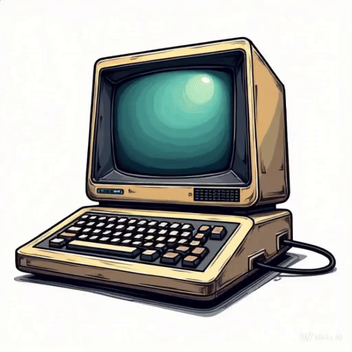
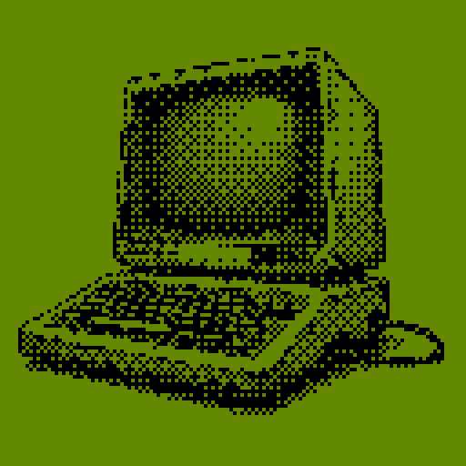

# Dither Guy 

[](https://github.com/manoelpiovesan/dither-guy/actions/workflows/main.yml)
[](https://github.com/manoelpiovesan/dither-guy/releases/latest)
[](https://github.com/manoelpiovesan/dither-guy/releases)
[](https://github.com/manoelpiovesan/dither-guy/releases/latest)


Dither Guy is inspired by the [Dither Boy](https://studioaaa.com/product/dither-boy/) software, used to create graphic dithering effects, similar to old screens.

[](https://ko-fi.com/L3L61SRB88)

## Download

Download the latest release for your platform, visit the [releases page](https://github.com/manoelpiovesan/dither-guy/releases/latest) to see all available versions.


## Input x Output

<div style="display: inline-block; margin-right: 10px;">
  
</div>
<div style="display: inline-block;">
  
</div>
<div style="display: inline-block;">
  
</div>

## Running as development mode

```bash
python3 -m venv venv
source venve/bin/activate
pip install -r requirements.txt
python3 dither_guy.py
```

## BETA Video Dithering




