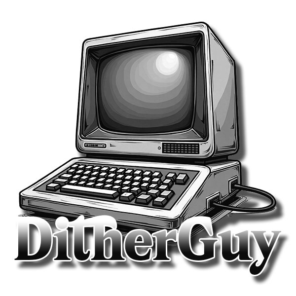
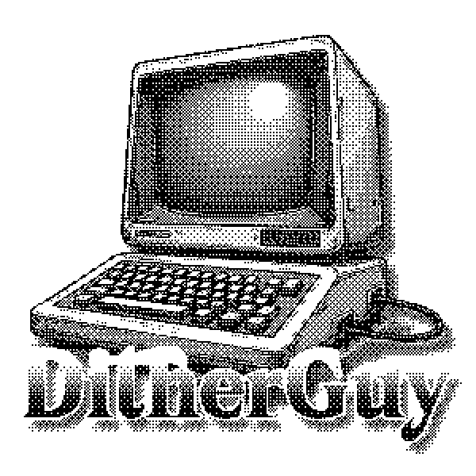
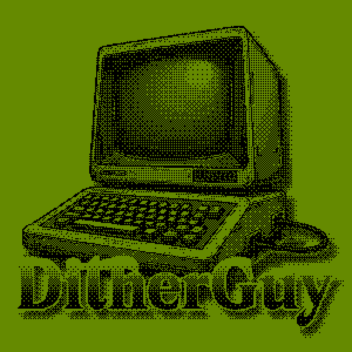

# Dither Guy

[](https://github.com/manoelpiovesan/dither-guy/actions/workflows/main.yml)
[](https://github.com/manoelpiovesan/dither-guy/releases/latest)
[](https://github.com/manoelpiovesan/dither-guy/releases)
[](https://github.com/manoelpiovesan/dither-guy/releases/latest)

**Dither Guy** is a software inspired by [Dither Boy](https://studioaaa.com/product/dither-boy/), designed to create graphic dithering effects similar to those found on old displays and low color-depth systems.

The project focuses on providing a simple and straightforward tool for applying dithering to images and videos, preserving a controlled and retro visual aesthetic.

[](https://ko-fi.com/L3L61SRB88)

---

## Download

The latest binaries for each platform are available on the releases page:

👉 https://github.com/manoelpiovesan/dither-guy/releases/latest


---

## Input × Output

Examples of input and output using different dithering configurations:

| Original | Dithered | Colored |
|----------|----------|---------|
||| |

---

## Running in Development Mode

To run the project locally in development mode:

```bash
python3 -m venv venv
source venv/bin/activate
pip install -r requirements.txt
python3 dither_guy.py

```

## BETA Video Dithering


